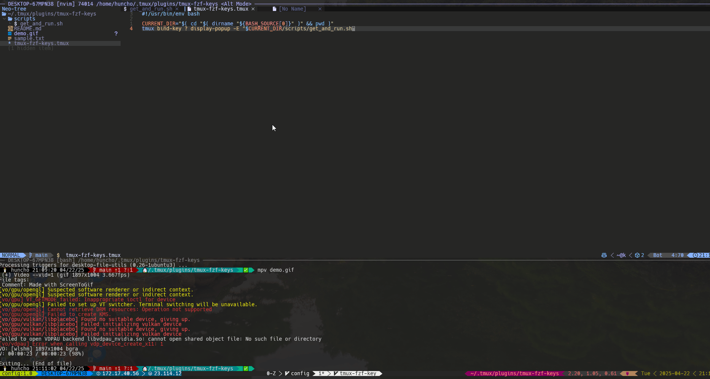

# 🔥 tmux-fzf-keys

A fuzzy-powered popup to **search, learn, and run any tmux keybinding**.  
Perfect for power users, beginners, and everyone in between. 🚀



---

## 💡 Why use this?

Getting lost in tmux keybindings?  
Stop memorizing — **start searching**. This plugin helps you:

- 🔍 Quickly discover available keybindings
- 🧠 Learn tmux tables like `prefix`, `copy-mode`, and more
- ⚡ Run any binding directly from an interactive list
- 🧩 Customize your workflow and explore tmux like a pro

---

## ⚙️ Features

- 🧠 Fuzzy-search all `tmux list-keys` output by table
- ⌨️ Review full commands before running
- 👆 Opens in a popup so you never leave your session
- 🧩 Clean plugin structure — easy to extend
- ✅ Automatically uses popup for interactive commands

---

## 📦 Prerequisites

- [fzf](https://github.com/junegunn/fzf) must be installed and available in your `$PATH`

---

## 🔧 Installation

### Using [TPM (Tmux Plugin Manager)](https://github.com/tmux-plugins/tpm)

Add the following to your `.tmux.conf`:

```tmux
set -g @plugin 'huncholane/tmux-fzf-keys'
```

Then reload tmux and install plugins:

```bash
prefix + I
```

---

## 🧪 Usage

Hit:

```text
prefix + ?
```

This opens a popup with a fuzzy list of all current tmux keybindings.

- Type to search
- Preview the command
- Press `Enter` to run it instantly

---

## 🛠 Custom Keybinding (optional)

To override the default key:

```tmux
unbind ?
bind C-f run-shell "#{plugin_path}/scripts/get_and_run.sh"
```

---

## 🤝 Contributing

Suggestions, feedback, and PRs welcome!
This plugin is meant to help others explore and understand tmux.
Open an issue or fork the repo and submit your ideas!

---

## 📜 License

MIT
